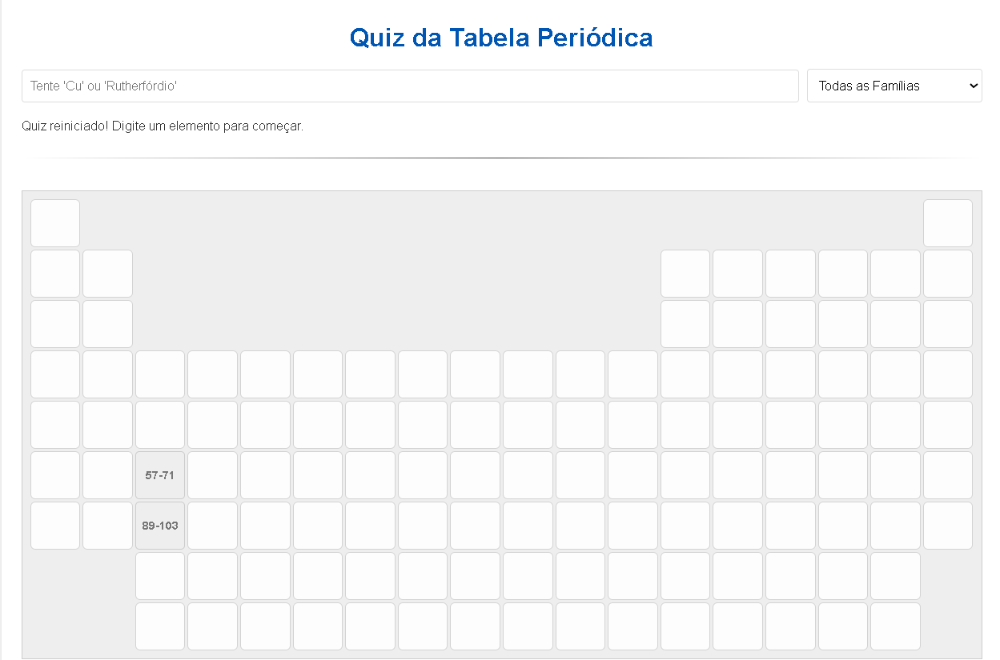

# Ptable Quiz
This is a quiz that uses the Elements of the Periodic Table, works with Symbol and name in Portuguese, French, English and German.

## About
This project is based on Geography Quizes I've ever saw like [Cityquiz.io](cityquiz.io)