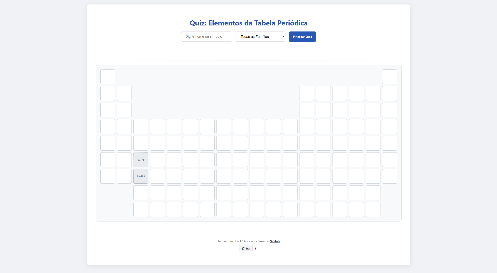

# Ptable Quiz

This is a quiz that uses the Elements of the Periodic Table, works with the Symbol and the Name in Portuguese, French, English and German.


You may check my work [clicking here](https://gustavo-vieira-unasp.github.io/ptable-quizz/)!

## About

This project is based on Geography Quizes I've ever saw, like: [Cityquiz.io](cityquiz.io)

## Instalation

1. Clone and enter the folder

    ```bash
    git clone https://github.com/Gustavo-Vieira-Unasp/ptable-quizz
    cd ptable-quizz
    ```

2. Install `node_modules`

    ```bash
    npx install
    ```

3. Open the index.html
    >Preferencially using `Live Server`

4. (Optional) create a database to save your data
    >(Currently) I did use a simple `Supabase` structure

    ```supabase
    tries
    | id | created_at | elementos_ids |
    ```
